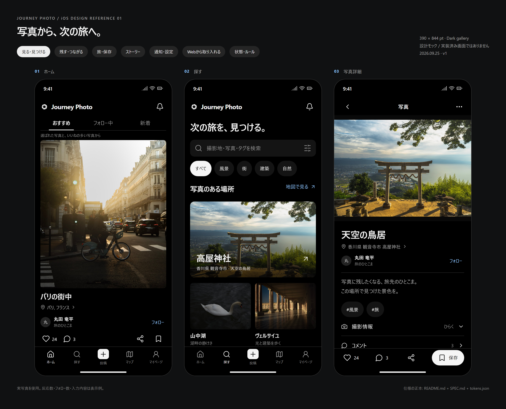
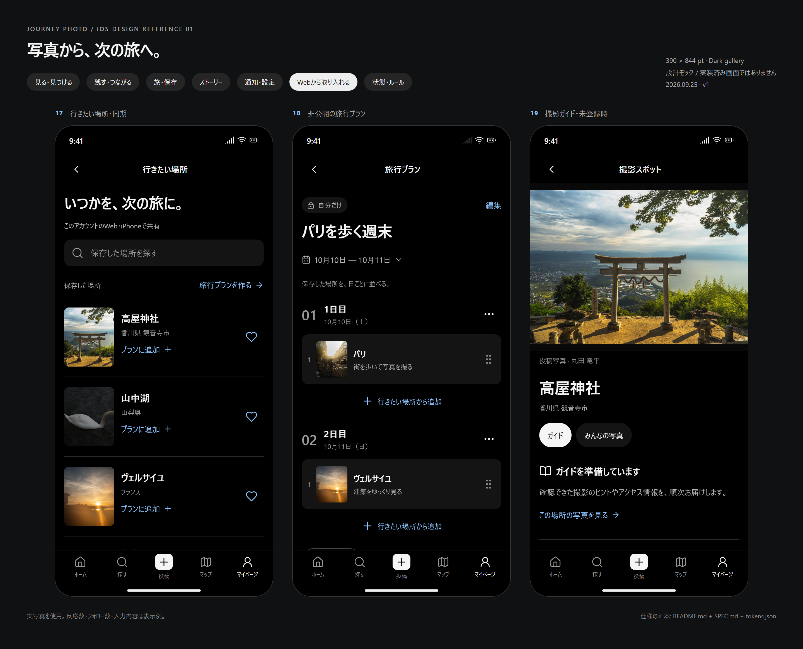

# Design v1 — 写真から、次の旅へ。

2026-09-25 / Journey Photo iOS / **採用する設計案・実装前**

「旅先の一枚をじっくり見る → 場所を知る → 行きたい場所に残す → 旅を計画する → 写真で振り返る」を一つの体験にする。黒いギャラリー、既存のロゴ、5つのメイン導線を継承し、写真より先に操作が並ぶホームを整理する。

## 最初に見るもの

| ボード | 対象 | 画像 |
|---|---|---|
| 見る・見つける | ホーム、探す、写真詳細 | [board-discovery.png](images/board-discovery.png) |
| 残す・つながる | マイページ、投稿の入口、写真投稿 | [board-creation.png](images/board-creation.png) |
| 旅・保存 | 保存した写真、撮影スポット、旅の一冊 | [board-journey.png](images/board-journey.png) |
| ストーリー | 閲覧、作成、フォロー中の空状態 | [board-stories.png](images/board-stories.png) |
| 通知・設定 | お知らせ、設定、マイページ | [board-account.png](images/board-account.png) |
| Webから取り入れる | 行きたい場所の同期、旅行プラン、ガイド未登録時 | [board-web.png](images/board-web.png) |
| 状態・ルール | 空状態、色・文字・余白、読み込み・失敗 | [board-states.png](images/board-states.png) |





## 個別の画像

基準サイズは **390 × 844 pt**。PNGは2倍の **780 × 1688 px**。07・08は同寸の仕様ボードで、アプリ画面ではない。スクロール画面のPNGは初期表示位置であり、画面全体の情報を1枚に詰め込まない。

| ID | 画像 | 実装の意味 |
|---|---|---|
| 01 | [ホーム](images/01-home.png) | フィード切り替え1列、写真の構図、写真に紐づく操作 |
| 02 | [探す](images/02-explore.png) | 場所を中心にした探索、カテゴリ、色・機材への続き |
| 03 | [写真詳細](images/03-detail.png) | 全体像、撮影地、作者、説明、固定の操作バー |
| 04 | [マイページ](images/04-profile.png) | これからの「旅行プラン」と、これまでの「旅の一冊」 |
| 05 | [写真投稿](images/05-compose.png) | プレビュー、基本情報、公開範囲、詳細設定 |
| 06 | [フォロー中の0件](images/06-empty.png) | エラー扱いせず探索へ戻す |
| 07 | [デザイントークン](images/07-tokens.png) | 色・文字・余白・タップ領域 |
| 08 | [状態と操作](images/08-states.png) | 読み込み、再試行、成功、失敗 |
| 09 | [保存した写真](images/09-saved.png) | ブックマークした写真を本人だけが見る |
| 10 | [撮影スポット](images/10-spot.png) | 行きたい・地図・その場所の写真 |
| 11 | [旅の一冊](images/11-book.png) | 旅の表紙と日ごとの写真 |
| 12 | [お知らせ](images/12-notifications.png) | 日付別、未読、対象の写真 |
| 13 | [設定](images/13-settings.png) | アカウント・通知・プライバシー・サポート |
| 14 | [投稿の入口](images/14-choice.png) | 永続する写真と24時間のストーリーを選ぶ |
| 15 | [ストーリー閲覧](images/15-story.png) | 写真に集中、進行表示、一時停止、返信 |
| 16 | [ストーリー作成](images/16-story-compose.png) | キャンバス中心、文字・場所・曲、公開対象を明示 |
| 17 | [行きたい場所](images/17-wishlist.png) | Webとの同期と旅行プランへの追加。API接続後に公開 |
| 18 | [旅行プラン](images/18-plan.png) | 日付・順番・メモ。非公開のみ。API接続後に公開 |
| 19 | [撮影ガイド未登録時](images/19-guide.png) | ガイドと投稿写真を区別し、情報不足を正直に示す |

**マップは既存MapKitを継承**し、改修契約を [SPEC.md](SPEC.md#マップ既存を継承) に記載。既存の地図画像を新デザインの成果物として再掲していない。アルバム、招待、ログイン、法的同意、アカウント削除などは既存機能を維持し、共通部品を適用する。これらの個別画像は本版には含めない。

## 正本と作業手順

- **見た目:** このPNGと [index.html](index.html)。スクリーンショットを比較する際は390pt幅で表示する。
- **挙動と例外:** [SPEC.md](SPEC.md)。画像で見えないスクロール先、データなし、ログイン前、API失敗を含む。
- **機能の根拠・準備条件:** [WEB_FEATURES.md](WEB_FEATURES.md)。APIコードの存在と本番での利用可能性を混同しない。
- **数値:** [tokens.json](tokens.json)。SwiftUIではDynamic Typeに対応する。
- **着手順:** [IMPLEMENTATION.md](IMPLEMENTATION.md)。まず既存導線の不具合修正、次に見た目、最後にAPI接続が必要な機能。

画像と本文が矛盾したら、挙動はSPEC、値はtokensを正として画像も直す。独自に推測して進めず、不整合を変更理由に残す。

## 編集・再生成

[index.html](index.html) をブラウザで開くと7つのボードを切り替えられる。ネットワーク不要。これは設計確認用のモックであり、投稿・保存・通知などを実際のAPIに送信しない。ボタンの一部は表示状態の切り替え、その他は遷移先を示す短いメッセージのみ。

画面は `reference.js` / `extended.js` / `web-features.js`、見た目は対応するCSSで編集する。`render.cjs` と `package.json` でPNGを再生成する。

```sh
cd docs/design/v1
npm ci
# ブラウザが無い環境では一度だけ:
npx playwright-core install chromium
npm run render
```

既存Chromeを使う場合は `DESIGN_BROWSER_PATH` に実行ファイルの絶対パスを設定する。画像とソースは同じコミットで更新する。モック内の時計、プロフィール文、反応数、通知の人物、日付、日程・メモは表示例で、実ユーザーデータではない。

## 素材と確認したソース

- iOS基準: `49ae87ff0663c8d9702db28fb311208bce71df7b`。`screenshots` の実行68（2026-09-24T20:47Z）で現行画面も確認。
- Web基準: `d1fd52c7f9d0009877a7ecac577b6d1560e81d38`。実装根拠は [WEB_FEATURES.md](WEB_FEATURES.md)。
- 写真6枚: 同所有者の `photo-gallery/app/data/photos.json` に掲載されている公開写真。作者・元URLは [assets/photo-sources.json](assets/photo-sources.json)。写真自体は加工していない。モックの表示領域に合わせた拡大縮小・トリミングのみ。
- ロゴ: 既存サイトの `public/logo-aperture.png` を無加工で複製。Git blob SHA: `6f36a54375ca223a4330ee90240762816459c560`。サイト・アプリの元アイコン資産は変更しない。
- アイコン: Lucide 0.468.0（[ライセンス](assets/LUCIDE-LICENSE)）。iOS実装ではSPECの対応表に従いSF Symbolsへ置き換える。
- 描画: HTML/CSSをChromiumでレンダリング。AI生成の風景や生成文字を仕様の根拠にはしていない。
- 検証記録: [VALIDATION.md](VALIDATION.md)。実機のSwiftUI表示やVoiceOverの検証済みを意味しない。
