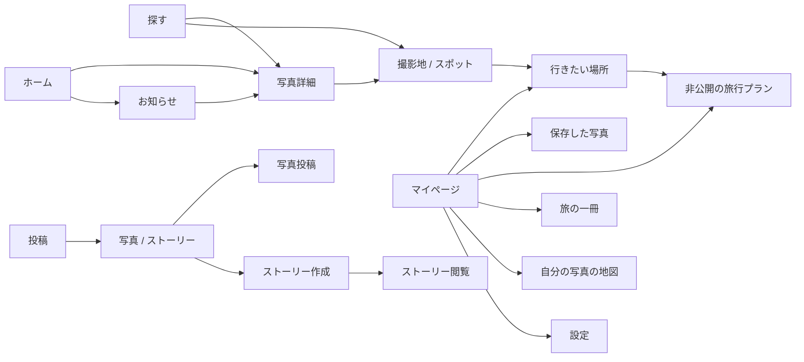

# Design v1 実装仕様

## 体験の優先順位

1. 写真の構図が分かる。
2. どこで、誰が撮ったか分かる。
3. 写真を保存する／場所を行きたいに残す。
4. 必要なときに撮影情報や会話を開く。
5. 行きたい場所を計画に変え、帰ってから旅の一冊で振り返る。

メインタブは **ホーム／探す／投稿／マップ／マイページ**。投稿は画面切り替えではなく作成シートを開く。閉じると元のタブ・スクロール位置へ戻る。通知はベル、設定はマイページ右上の歯車。画像で他の詳細ページに共通表示されている「…」は配置例であり、実際の操作がないページでは表示しない。

## 画面間の移動

**用語を分離する:** 写真の「いいね」は作者への反応。「保存」は自分用のブックマーク。「行きたい」は場所。「旅行プラン」は未来の日程。「旅の一冊」は既存の写真から振り返る記録。同じストア・件数・アイコンの選択状態を使い回さない。

## 共通の見た目

- 正式な値は `tokens.json`。黒背景・白い主操作・青いリンクを採用。大きなグラデーションや装飾的なカードを増やさない。
- iOSではSF系のシステムフォントを使う。Windows描画の日本語フォント差を再現しない。本文15ptは標準サイズでの基準で、Dynamic Typeで拡大する。固定高さ内に縮小して収めない。
- 写真の角丸8pt、入力や補助面12pt、作成の選択カード16pt。丸いチップは選択肢に限定。
- 普通の本文は4.5:1以上、アイコン等の主要な視認要素は3:1以上を受け入れ基準にする。写真上の文字は局所的な暗い下地を付ける。色だけで選択を伝えない。
- 操作の**個々の当たり領域**を44pt以上とする。親HStackの高さだけで達成したことにしない。大きな文字ではアイコン＋文言を折り返すか縦に並べる。
- `safeAreaInset` 等で固定バーと本文の領域を分ける。54/34ptのモックのセーフエリアを実装にハードコードしない。
- アイコン対応: `house`、`magnifyingglass`、`plus`、`map`、`person`、`bell`、`gearshape`、`heart/heart.fill`、`bookmark/bookmark.fill`、`bubble.right`、`square.and.arrow.up`、`mappin`、`ellipsis`。Lucideの輪郭を独自SVGとして移植しない。

## 01 ホーム

- 上部には「おすすめ／フォロー中／新着」だけを置く。「自分／フォロー中／すべて」のもう一列は削除する。自分の写真はマイページへ。
- 0件・読み込み・失敗時も切り替えを残す。選択変更時はそのフィードの先頭へ。戻る操作では元の位置を復元する。
- 未ログイン時は「フォロー中」を表示しない。ログイン後の状態確定でユーザーが選んだフィードを不意に変えない。
- おすすめは既存の featured → いいね順という規則を説明する。個人最適化、閲覧回数、AI推薦であるとは表現しない。初回読み込み・更新・再ログインでも選択中の並び順を適用する。
- モックはストーリー0件時。未読があれば小さい横並びをフィード先頭に表示し、全部既読なら折りたたみ可。0件で「＋」だけの行を出さない。投稿入口は中央タブに残る。
- 今日のテーマはおすすめの2投稿後。1投稿しかなければその後。大きな参加CTAで最初の写真を押し下げない。特集はおすすめ内だけ。フォロー中と新着に他の写真群を割り込ませない。
- 単写真は元の縦横比、最大高さは使用可能な画面の56%。上限を超えた場合は黒い余白で収め、切り抜かない。取得済み寸法があれば先に確保し、なければ4:3のプレースホルダー。読み込みによる大きなジャンプを抑える。
- 複数写真は最初の写真で決めた枠を投稿単位で固定し、各写真をfit。1/N、ページ位置、タイトル・説明・タグ・場所・共有・保存・いいね・通報の対象を同じphotoIdに揃える。
- 画面をスワイプして通信が完了しても、開始時のphotoIdへ結果を反映する。数と進行状態はphotoId別に保持。二重送信を抑制する。
- 写真→タイトル→場所→作者→反応の順。長い説明は3行まで＋「続きを読む」。タグは折り返し、1行HStackにはしない。
- 「…」は共有・通報／ブロック、本人なら編集・削除へ。空のクロージャーで表示しない。既存詳細メニューを再利用する。

## 02 探す

- 検索欄を上に固定し、カテゴリは横一列。操作領域は44ptを維持。
- デフォルトは「写真のある場所」。地域（例:パリ）と具体的なスポット（例:高屋神社）を内部データで区別し、地域を公式スポットに変換しない。
- 大きい代表枠1件＋小さい枠2件。その下に「色から探す」「機材から探す」。写真枚数や順位は実データがある場合のみ出す。
- 検索を始めると探索棚から結果一覧に切り替える。検索中・0件・通信失敗を分離し、クエリと絞り込みを残す。写真・人の区分を明示する。
- 色・焦点距離による探索はiOSに既存実装あり。新機能として増築せず、現在のデータに合う棚だけを見せる。Webのblur由来の色改善は比較検証後に統合する。
- ガイド台帳が利用可能になれば、写真が0件でも公開条件を満たすスポットを探索に含められる（WEB_FEATURES参照）。

## 03 写真詳細

- トップには戻る、必要な場合だけ「…」。全体写真をfit。下にタイトル・場所・作者・説明。撮影情報は折りたたむ。
- 下部は「いいね／コメント／共有／保存」の固定バー。詳細ではタブバーを隠す。コメントはシート／拡張可能な領域にし、写真の初期表示を入力欄で圧迫しない。
- 一覧で2枚目を開いたら詳細でも2枚目を表示。詳細内のページ変更でも対象photoIdを揃え、詳細ViewModelを再初期化／再読込する。写真だけ切り替えてコメントが前の写真のままになる実装は禁止。
- 写真の保存は `SaveService`。いいねは `SocialService`。未ログインの書き込みは理由つきログインへ、成功後に元の写真へ戻る。
- 機材がない場合は撮影情報行を出さない。場所がない場合は場所行を出さない。ない情報の代わりにカテゴリーや架空のカメラを埋めない。

## 04 マイページ / 09 保存

- カバー、本人、短い説明、件数、2つの旅導線、写真グリッド。カバーがなければ静かな面、アバターがなければイニシャル。
- 「旅行プラン＝これから」「旅の一冊＝これまで」を並べる。APIが未接続の間は旅行プランを出さず既存の旅の一冊だけにする。
- 「投稿／保存／行きたい」は本人用。他人には公開投稿と地図のみ。非公開の保存や旅行プランの入口を出さない。
- 既存の自分の写真マップはヘッダーの地図操作／プロフィールメニューから到達できる状態を維持。その他、ハイライト、アルバム、いいねした写真、距離・訪問国の既存導線も削除しない。補助セクション／メニューへ整理する。
- 「保存」の中身は `SavedPhotosStore` + `/user/saves`。既存 `FavoritesStore` はいいねであり置き換えない。
- 保存一覧は撮影地・タイトルの手元検索。非公開化・削除された写真は表示できない旨を示す。解除はメニューから、失敗時は元の状態へ。

## 05 写真投稿 / 14 投稿の入口

- 作成シートで写真とストーリーを選ぶ。違いは「旅の記録として残す」「24時間・フォロワーに届く」。下書きが実際にある場合だけ再開を提示。
- 写真選択→写真プレビューと基本項目→投稿。タイトル、説明、撮影地、公開範囲を先に見せる。カテゴリ・タグ・音楽・アルバムは「その他」にまとめ、設定済みなら要約を示す。
- 複数写真は選択順・個別タイトル・説明・削除・グループ投稿を維持する。画像05は単写真の場合であり機能削除の指示ではない。
- 投稿ボタンはキーボードと安全領域に追従。投稿中は二重送信不可。アップロード枚数、失敗した写真、再試行を表示。成功するまで下書きを破棄しない。途中で閉じる場合は変更があるときだけ破棄確認。
- GPSの約1km丸め・EXIF除去は既存処理を維持。公開範囲を最後に確認できる位置に置く。制限公開を選んだ場合、共有URLの有無もそのルールに従う。

## 06 / 08 状態

| 状態 | 画面と操作 |
|---|---|
| 初回読込 | 写真と同じ形のプレースホルダー。意味のない件数0を表示しない |
| 更新中 | 既存の写真を残す。更新表示のみ追加 |
| 通信失敗 | 既存データがあれば残し、短い理由と再読込。新規画面は専用の失敗表示 |
| フォロー中0件 | 人のアイコン、説明、「写真を探す」「おすすめを見る」 |
| 保存0件 | ブックマークの説明＋「写真を探す」 |
| 検索0件 | クエリと条件を残し「条件をクリア」 |
| 未ログイン | 閲覧可能な写真は見せる。保存や計画など本人用操作で認証を案内 |
| 保存失敗 | 状態を戻し、再試行できるメッセージ。成功色を残さない |
| 削除 | 対象名と影響を確認してから削除。キャンセル時に変更しない |

## 10 スポット / 17 行きたい / 19 ガイド

- 10は写真から集約する既存の撮影地。地名・写真・行きたい・地図・共有を中心にする。公式に確認したガイドとは区別する。
- 17はサーバー同期後の採用案。同期実装前に「Web・iPhoneで共有」を表示しない。読み込みに失敗した場合は未保存扱いにせず、最後の控え＋再試行。
- 写真のブックマークとは別のデータ。スラッグと公式spotIdを混同しない。既存ローカル保存の移行はWEB_FEATURESに従う。
- 19は現在の空台帳に対応する表示。「ガイド」と「みんなの写真」を分ける。未登録の情報を推測して埋めない。ユーザー写真には「投稿写真」と作者を示す。
- **データが揃った場合のガイド順序:** 代表写真（権利表示）→名称・概要→行きたい／地図→見どころ→季節・時間帯→構図→アクセス→注意点→出典と確認日→近隣の場所→投稿写真。各節は値があるときだけ。
- アクセス・駐車場・注意点は対応する出典＋確認日がない場合は非表示。写真0件でもガイドが成立する。ガイド0件でも現行の写真集約は使える。

## 11 旅の一冊 / 18 旅行プラン

- 11は既存 `TripBook` から生成する振り返り。表紙と期間、日ごとに写真、最後に足取り。投稿を旅行プランの予定として取り込まない。
- 18は新しいiOS画面。Webに実装済みの非公開プランを利用。日付は任意、1日ごとの場所の順序と200文字までのメモ。題・日付・日・項目を編集できる。
- 「保存した場所から追加」はスポット／撮影地の型を維持。サーバーにない任意の予約、宿泊、移動時間、AI最適化、共同編集、プラン公開は足さない。
- 編集中はローカルの変更を保持し、明示的な「変更を保存」。成功応答の一覧で確定する。失敗や競合時に入力を破棄しない。保存中にログアウトしたら別アカウントへ書き込まない。
- 上限に当たった場合はAPIの理由を表示し、古いプランや項目を黙って消さない。

## 12 お知らせ / 13 設定

- お知らせは種類フィルター、今日／昨日／それ以前。未読は点と読み上げで示す。コメントは短い抜粋。対象写真と対象ユーザーへの操作を区別。
- 設定はアカウント、通知、プライバシー、データ、サポート。OSで通知が拒否されている場合はオンに見せず、iOS設定への導線を示す。
- バージョン、キャッシュ容量は実値。ログアウトと削除を一覧の下部に離して配置。アカウント削除は既存の専用確認フローを維持。

## 15 ストーリー閲覧 / 16 作成

- 閲覧は全画面。進行、一時停止、閉じるは安全領域内。長押しで停止する場合も、読上げとキーボード相当の操作で使える停止ボタンを残す。
- 他の画面・返信入力・バックグラウンドへの移動で自動送りと音を止める。動画／音声は既存仕様を維持し、音楽を無条件に自動再生しない。
- 写真の端を左右タップで送る。返信・いいね・閉じるの当たり領域と重ねない。読めない画像を真っ黒なまま時間切れにしない。
- 作成は実画像を中心に文字・場所・曲を配置。文字の下地、サイズ、コントラストを担保。既存の下書き、3〜15秒、曲の30秒試聴、自分用アーカイブの機能を詳細設定で維持。
- 投稿対象は現行APIに合わせてフォロワー。架空の公開範囲を増やさない。自分のストーリーでは返信欄を出さず、既存の閲覧者・管理機能を表示。

## マップ（既存を継承）

- MapKitを全面に置き、検索は上、再検索は地図移動後だけ表示。カテゴリは横一列で、不要なら折りたたむ。
- 選択ピンと下部の写真カードを連動。下部カードから写真詳細／撮影地へ。現在地ボタンは44pt以上。
- 掲載可能な座標がある写真／スポットだけを置く。地名から推測した位置を実際の撮影地点のように描かない。位置権限なしでも地名検索と手動移動は使える。
- 写真が0件なら範囲変更を促す。OS地図の帰属表示と地図操作をカードで覆わない。正確なルート・所要時間が必要なら外部の地図へ。
- 自分の写真マップと公開マップの範囲を明示し、非公開写真を公開側へ混ぜない。

## 実機での受け入れ条件

390ptだけでなく320/375/430pt、縦横写真、極端に長い地名、日本語／英語、Dynamic Type最大サイズを確認。小画面では写真の高さを縮小し、操作領域を縮めない。

- [ ] ホームで初期表示から写真が見え、空状態でもフィードを変更できる。
- [ ] グループの2枚目で保存・いいね・通報・コメントを押すと2枚目が対象になる。通信中にスワイプしても対象が変わらない。
- [ ] 縦横比とfocalPointの役割を分け、詳細の構図が欠けない。
- [ ] 下部バー、キーボード、ミニプレイヤーが最後の行を覆わない。
- [ ] 新しい公開・フォロー・保存・同期の表現は、実際のAPI結果と一致する。
- [ ] VoiceOverでボタン名・状態・対象写真・件数が分かる。装飾画像は重複読み上げしない。
- [ ] Reduce Motionに従う。0件／失敗／未ログイン／権限拒否を実機で通す。
- [ ] 投稿・保存・旅行プランで通信失敗しても入力が残り、再試行できる。

## ブランドの固定条件

ユーザー指定: **サイトのアイコンは変更しない**。favicon、PWAアイコン、ロゴ、iOS AppIcon、AppLogo.swiftを本設計の変更対象に含めない。資料のヘッダーには既存サイトのlogo-aperture.pngを無加工で表示する。iOS固有の既存ヘッダーマークを置換する指示ではない。形・色・比率の再デザインは禁止。
